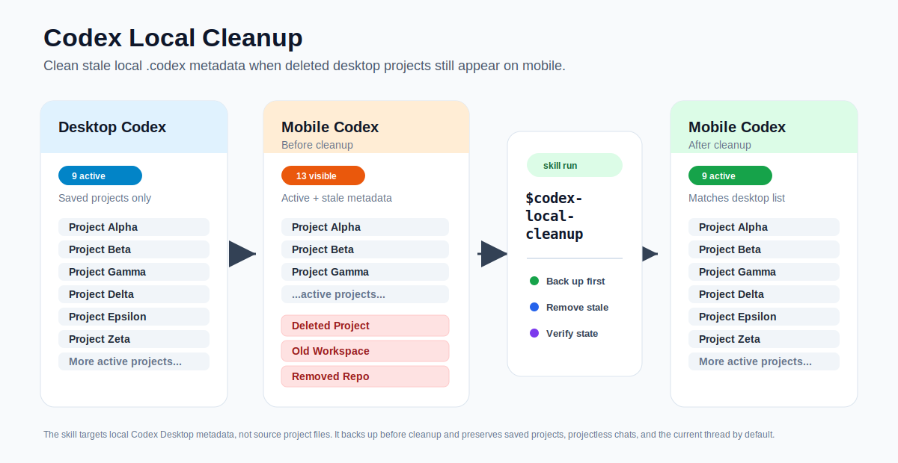

# Codex Local Cleanup Skill

`codex-local-cleanup` is a Codex skill for safely cleaning stale Codex Desktop project and thread metadata, deleted project traces, archived threads, and old local state under `~/.codex`.

It is intended for cases where old project entries, archived threads, deleted workspace paths, or mobile-visible sidebar clutter remain after projects were removed or reorganized.

The goal is for the mobile-visible project list to match the active saved projects shown in Codex Desktop.



## Translations

- [한국어](docs/README.ko.md)
- [日本語](docs/README.ja.md)
- [简体中文](docs/README.zh-CN.md)
- [繁體中文](docs/README.zh-TW.md)
- [Русский](docs/README.ru.md)
- [Español](docs/README.es.md)
- [Français](docs/README.fr.md)
- [Deutsch](docs/README.de.md)

## What It Does

- Reads saved project roots from `.codex-global-state.json`.
- Classifies threads in `state_*.sqlite` by `cwd`.
- Keeps saved projects, projectless chats, and the current thread by default.
- Inspects legacy `.codex/sqlite/state_*.sqlite` and `.codex/sqlite/logs_*.sqlite` when mobile still shows entries that are already absent from the active database.
- Treats renamed saved projects as display-label sync issues, not stale deletion targets.
- Finds non-active project threads outside saved project roots.
- Finds deleted `cwd` entries and stale archived threads.
- Backs up affected metadata before changing anything.
- Cleans matching session JSONL files, thread indexes, global state, `config.toml`, and SQLite rows.
- Verifies SQLite integrity and checks that removed targets no longer appear.

## Installation

Recommended: ask Codex to install this repository path with the built-in `skill-installer` skill:

```text
$skill-installer Install the skill from https://github.com/cku3987/codex-local-cleanup-skill/tree/main/codex-local-cleanup
```

Manual install: copy the skill folder into your Codex skills directory:

```powershell
Copy-Item -Recurse .\codex-local-cleanup "$env:USERPROFILE\.codex\skills\codex-local-cleanup"
```

Restart Codex Desktop after installation if the skill does not appear immediately.

## Example Prompts

```text
$codex-local-cleanup Keep my saved projects and projectless chats, then back up and clean non-active project metadata from local Codex.
```

```text
$codex-local-cleanup Find deleted cwd threads in my local Codex metadata, back them up, remove only those stale entries, and verify the result.
```

```text
$codex-local-cleanup Clean saved-project-outside project traces, but do not delete archived_sessions.
```

## Safety Notes

This skill works with local Codex Desktop state. It should always back up before modifying metadata.

Important risk and permission notes:

- This is local application-state cleanup, not source-code cleanup.
- It can delete Codex thread metadata, session JSONL files, sidebar indexes, trust entries, and SQLite rows for selected targets.
- In full-access or no-approval environments, Codex may be able to write immediately. Ask for a read-only inventory first if you are unsure.
- Do not run broad cleanup from a vague prompt. Review the target list, backup path, and preservation rules before allowing writes.
- Backups may contain local paths, thread titles, prompts, and conversation content. Keep backups private.

It should not delete or rewrite:

- `auth.json`
- `installation_id`
- `skills/`
- `plugins/`
- `automations/`
- `.sandbox-secrets/`
- user source projects

The skill is intentionally conservative. It preserves saved project roots, projectless chats, and the current thread unless explicitly instructed otherwise.

## Repository Layout

```text
codex-local-cleanup-skill/
├─ README.md
├─ LICENSE
├─ .gitignore
└─ codex-local-cleanup/
   ├─ SKILL.md
   └─ agents/
      └─ openai.yaml
```

## License

MIT
